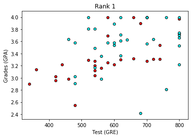

# Predicting Student Admissions with Neural Networks in Keras
In this notebook, we predict student admissions to graduate school at UCLA based on three pieces of data:
- GRE Scores (Test)
- GPA Scores (Grades)
- Class rank (1-4)

The dataset originally came from here: http://www.ats.ucla.edu/

## Loading the data
To load the data and format it nicely, we will use two very useful packages called Pandas and Numpy. You can read on the documentation here:
- https://pandas.pydata.org/pandas-docs/stable/
- https://docs.scipy.org/


```python
# Importing pandas and numpy
import pandas as pd
import numpy as np

# Reading the csv file into a pandas DataFrame
data = pd.read_csv('student_data.csv')

# Printing out the first 10 rows of our data
data[:10]
```


<div>
<style>
    .dataframe thead tr:only-child th {
        text-align: right;
    }

    .dataframe thead th {
        text-align: left;
    }

    .dataframe tbody tr th {
        vertical-align: top;
    }
</style>
<table border="1" class="dataframe">
  <thead>
    <tr style="text-align: right;">
      <th></th>
      <th>admit</th>
      <th>gre</th>
      <th>gpa</th>
      <th>rank</th>
    </tr>
  </thead>
  <tbody>
    <tr>
      <th>0</th>
      <td>0</td>
      <td>380</td>
      <td>3.61</td>
      <td>3</td>
    </tr>
    <tr>
      <th>1</th>
      <td>1</td>
      <td>660</td>
      <td>3.67</td>
      <td>3</td>
    </tr>
    <tr>
      <th>2</th>
      <td>1</td>
      <td>800</td>
      <td>4.00</td>
      <td>1</td>
    </tr>
    <tr>
      <th>3</th>
      <td>1</td>
      <td>640</td>
      <td>3.19</td>
      <td>4</td>
    </tr>
    <tr>
      <th>4</th>
      <td>0</td>
      <td>520</td>
      <td>2.93</td>
      <td>4</td>
    </tr>
    <tr>
      <th>5</th>
      <td>1</td>
      <td>760</td>
      <td>3.00</td>
      <td>2</td>
    </tr>
    <tr>
      <th>6</th>
      <td>1</td>
      <td>560</td>
      <td>2.98</td>
      <td>1</td>
    </tr>
    <tr>
      <th>7</th>
      <td>0</td>
      <td>400</td>
      <td>3.08</td>
      <td>2</td>
    </tr>
    <tr>
      <th>8</th>
      <td>1</td>
      <td>540</td>
      <td>3.39</td>
      <td>3</td>
    </tr>
    <tr>
      <th>9</th>
      <td>0</td>
      <td>700</td>
      <td>3.92</td>
      <td>2</td>
    </tr>
  </tbody>
</table>
</div>


## Plotting the data

First let's make a plot of our data to see how it looks. In order to have a 2D plot, let's ingore the rank.


```python
# Importing matplotlib
import matplotlib.pyplot as plt

# Function to help us plot
def plot_points(data):
    X = np.array(data[["gre","gpa"]])
    y = np.array(data["admit"])
    admitted = X[np.argwhere(y==1)]
    rejected = X[np.argwhere(y==0)]
    plt.scatter([s[0][0] for s in rejected], [s[0][1] for s in rejected], s = 25, color = 'red', edgecolor = 'k')
    plt.scatter([s[0][0] for s in admitted], [s[0][1] for s in admitted], s = 25, color = 'cyan', edgecolor = 'k')
    plt.xlabel('Test (GRE)')
    plt.ylabel('Grades (GPA)')
    
# Plotting the points
plot_points(data)
plt.show()
```


Roughly, it looks like the students with high scores in the grades and test passed, while the ones with low scores didn't, but the data is not as nicely separable as we hoped it would. Maybe it would help to take the rank into account? Let's make 4 plots, each one for each rank.


```python
# Separating the ranks
data_rank1 = data[data["rank"]==1]
data_rank2 = data[data["rank"]==2]
data_rank3 = data[data["rank"]==3]
data_rank4 = data[data["rank"]==4]

# Plotting the graphs
plot_points(data_rank1)
plt.title("Rank 1")
plt.show()
plot_points(data_rank2)
plt.title("Rank 2")
plt.show()
plot_points(data_rank3)
plt.title("Rank 3")
plt.show()
plot_points(data_rank4)
plt.title("Rank 4")
plt.show()
```





This looks more promising, as it seems that the lower the rank, the higher the acceptance rate. Let's use the rank as one of our inputs. In order to do this, we should one-hot encode it.

## One-hot encoding the rank
For this, we'll use the `get_dummies` function in pandas.


```python
# Make dummy variables for rank
one_hot_data = pd.concat([data, pd.get_dummies(data['rank'], prefix='rank')], axis=1)

# Drop the previous rank column
one_hot_data = one_hot_data.drop('rank', axis=1)

# Print the first 10 rows of our data
one_hot_data[:10]
```


<div>
<style>
    .dataframe thead tr:only-child th {
        text-align: right;
    }

    .dataframe thead th {
        text-align: left;
    }

    .dataframe tbody tr th {
        vertical-align: top;
    }
</style>
<table border="1" class="dataframe">
  <thead>
    <tr style="text-align: right;">
      <th></th>
      <th>admit</th>
      <th>gre</th>
      <th>gpa</th>
      <th>rank_1</th>
      <th>rank_2</th>
      <th>rank_3</th>
      <th>rank_4</th>
    </tr>
  </thead>
  <tbody>
    <tr>
      <th>0</th>
      <td>0</td>
      <td>380</td>
      <td>3.61</td>
      <td>0</td>
      <td>0</td>
      <td>1</td>
      <td>0</td>
    </tr>
    <tr>
      <th>1</th>
      <td>1</td>
      <td>660</td>
      <td>3.67</td>
      <td>0</td>
      <td>0</td>
      <td>1</td>
      <td>0</td>
    </tr>
    <tr>
      <th>2</th>
      <td>1</td>
      <td>800</td>
      <td>4.00</td>
      <td>1</td>
      <td>0</td>
      <td>0</td>
      <td>0</td>
    </tr>
    <tr>
      <th>3</th>
      <td>1</td>
      <td>640</td>
      <td>3.19</td>
      <td>0</td>
      <td>0</td>
      <td>0</td>
      <td>1</td>
    </tr>
    <tr>
      <th>4</th>
      <td>0</td>
      <td>520</td>
      <td>2.93</td>
      <td>0</td>
      <td>0</td>
      <td>0</td>
      <td>1</td>
    </tr>
    <tr>
      <th>5</th>
      <td>1</td>
      <td>760</td>
      <td>3.00</td>
      <td>0</td>
      <td>1</td>
      <td>0</td>
      <td>0</td>
    </tr>
    <tr>
      <th>6</th>
      <td>1</td>
      <td>560</td>
      <td>2.98</td>
      <td>1</td>
      <td>0</td>
      <td>0</td>
      <td>0</td>
    </tr>
    <tr>
      <th>7</th>
      <td>0</td>
      <td>400</td>
      <td>3.08</td>
      <td>0</td>
      <td>1</td>
      <td>0</td>
      <td>0</td>
    </tr>
    <tr>
      <th>8</th>
      <td>1</td>
      <td>540</td>
      <td>3.39</td>
      <td>0</td>
      <td>0</td>
      <td>1</td>
      <td>0</td>
    </tr>
    <tr>
      <th>9</th>
      <td>0</td>
      <td>700</td>
      <td>3.92</td>
      <td>0</td>
      <td>1</td>
      <td>0</td>
      <td>0</td>
    </tr>
  </tbody>
</table>
</div>


## Scaling the data
The next step is to scale the data. We notice that the range for grades is 1.0-4.0, whereas the range for test scores is roughly 200-800, which is much larger. This means our data is skewed, and that makes it hard for a neural network to handle. Let's fit our two features into a range of 0-1, by dividing the grades by 4.0, and the test score by 800.


```python
# Copying our data
processed_data = one_hot_data[:]

# Scaling the columns
processed_data['gre'] = processed_data['gre']/800
processed_data['gpa'] = processed_data['gpa']/4.0
processed_data[:10]
```


<div>
<style>
    .dataframe thead tr:only-child th {
        text-align: right;
    }

    .dataframe thead th {
        text-align: left;
    }

    .dataframe tbody tr th {
        vertical-align: top;
    }
</style>
<table border="1" class="dataframe">
  <thead>
    <tr style="text-align: right;">
      <th></th>
      <th>admit</th>
      <th>gre</th>
      <th>gpa</th>
      <th>rank_1</th>
      <th>rank_2</th>
      <th>rank_3</th>
      <th>rank_4</th>
    </tr>
  </thead>
  <tbody>
    <tr>
      <th>0</th>
      <td>0</td>
      <td>0.475</td>
      <td>0.9025</td>
      <td>0</td>
      <td>0</td>
      <td>1</td>
      <td>0</td>
    </tr>
    <tr>
      <th>1</th>
      <td>1</td>
      <td>0.825</td>
      <td>0.9175</td>
      <td>0</td>
      <td>0</td>
      <td>1</td>
      <td>0</td>
    </tr>
    <tr>
      <th>2</th>
      <td>1</td>
      <td>1.000</td>
      <td>1.0000</td>
      <td>1</td>
      <td>0</td>
      <td>0</td>
      <td>0</td>
    </tr>
    <tr>
      <th>3</th>
      <td>1</td>
      <td>0.800</td>
      <td>0.7975</td>
      <td>0</td>
      <td>0</td>
      <td>0</td>
      <td>1</td>
    </tr>
    <tr>
      <th>4</th>
      <td>0</td>
      <td>0.650</td>
      <td>0.7325</td>
      <td>0</td>
      <td>0</td>
      <td>0</td>
      <td>1</td>
    </tr>
    <tr>
      <th>5</th>
      <td>1</td>
      <td>0.950</td>
      <td>0.7500</td>
      <td>0</td>
      <td>1</td>
      <td>0</td>
      <td>0</td>
    </tr>
    <tr>
      <th>6</th>
      <td>1</td>
      <td>0.700</td>
      <td>0.7450</td>
      <td>1</td>
      <td>0</td>
      <td>0</td>
      <td>0</td>
    </tr>
    <tr>
      <th>7</th>
      <td>0</td>
      <td>0.500</td>
      <td>0.7700</td>
      <td>0</td>
      <td>1</td>
      <td>0</td>
      <td>0</td>
    </tr>
    <tr>
      <th>8</th>
      <td>1</td>
      <td>0.675</td>
      <td>0.8475</td>
      <td>0</td>
      <td>0</td>
      <td>1</td>
      <td>0</td>
    </tr>
    <tr>
      <th>9</th>
      <td>0</td>
      <td>0.875</td>
      <td>0.9800</td>
      <td>0</td>
      <td>1</td>
      <td>0</td>
      <td>0</td>
    </tr>
  </tbody>
</table>
</div>


## Splitting the data into Training and Testing

In order to test our algorithm, we'll split the data into a Training and a Testing set. The size of the testing set will be 10% of the total data.


```python
sample = np.random.choice(processed_data.index, size=int(len(processed_data)*0.9), replace=False)
train_data, test_data = processed_data.iloc[sample], processed_data.drop(sample)

print("Number of training samples is", len(train_data))
print("Number of testing samples is", len(test_data))
print(train_data[:10])
print(test_data[:10])
```

    Number of training samples is 360
    Number of testing samples is 40
         admit    gre     gpa  rank_1  rank_2  rank_3  rank_4
    110      0  0.850  0.7700       0       0       0       1
    67       0  0.775  0.8250       1       0       0       0
    189      0  0.625  0.8375       0       1       0       0
    334      1  0.575  0.9100       0       0       1       0
    176      0  0.650  0.6550       0       1       0       0
    386      1  0.925  0.9650       0       1       0       0
    46       1  0.725  0.8650       0       1       0       0
    84       1  0.625  0.9000       0       0       1       0
    241      1  0.650  0.9525       1       0       0       0
    205      1  0.975  0.9500       0       0       1       0
        admit    gre     gpa  rank_1  rank_2  rank_3  rank_4
    7       0  0.500  0.7700       0       1       0       0
    17      0  0.450  0.6400       0       0       1       0
    28      1  0.975  0.8050       0       1       0       0
    34      0  0.450  0.7850       1       0       0       0
    37      0  0.650  0.7250       0       0       1       0
    40      0  0.700  0.6050       0       1       0       0
    66      0  0.925  0.9050       0       0       0       1
    82      0  0.625  0.6775       0       1       0       0
    85      0  0.650  0.7450       0       1       0       0
    91      1  0.900  0.9100       1       0       0       0


## Splitting the data into features and targets (labels)
Now, as a final step before the training, we'll split the data into features (X) and targets (y).

Also, in Keras, we need to one-hot encode the output. We'll do this with the `to_categorical function`.


```python
import keras

# Separate data and one-hot encode the output
# Note: We're also turning the data into numpy arrays, in order to train the model in Keras
features = np.array(train_data.drop('admit', axis=1))
targets = np.array(keras.utils.to_categorical(train_data['admit'], 2))
features_test = np.array(test_data.drop('admit', axis=1))
targets_test = np.array(keras.utils.to_categorical(test_data['admit'], 2))

print(features[:10])
print(targets[:10])
```

    [[ 0.85    0.77    0.      0.      0.      1.    ]
     [ 0.775   0.825   1.      0.      0.      0.    ]
     [ 0.625   0.8375  0.      1.      0.      0.    ]
     [ 0.575   0.91    0.      0.      1.      0.    ]
     [ 0.65    0.655   0.      1.      0.      0.    ]
     [ 0.925   0.965   0.      1.      0.      0.    ]
     [ 0.725   0.865   0.      1.      0.      0.    ]
     [ 0.625   0.9     0.      0.      1.      0.    ]
     [ 0.65    0.9525  1.      0.      0.      0.    ]
     [ 0.975   0.95    0.      0.      1.      0.    ]]
    [[ 1.  0.]
     [ 1.  0.]
     [ 1.  0.]
     [ 0.  1.]
     [ 1.  0.]
     [ 0.  1.]
     [ 0.  1.]
     [ 0.  1.]
     [ 0.  1.]
     [ 0.  1.]]


## Defining the model architecture
Here's where we use Keras to build our neural network.


```python
# Imports
import numpy as np
from keras.models import Sequential
from keras.layers.core import Dense, Dropout, Activation
from keras.optimizers import SGD
from keras.utils import np_utils

# Building the model
model = Sequential()
model.add(Dense(128, activation='relu', input_shape=(6,)))
model.add(Dropout(.2))
model.add(Dense(64, activation='relu'))
model.add(Dropout(.1))
model.add(Dense(2, activation='softmax'))

# Compiling the model
model.compile(loss = 'categorical_crossentropy', optimizer='adam', metrics=['accuracy'])
model.summary()
```

    _________________________________________________________________
    Layer (type)                 Output Shape              Param #   
    =================================================================
    dense_7 (Dense)              (None, 128)               896       
    _________________________________________________________________
    dropout_5 (Dropout)          (None, 128)               0         
    _________________________________________________________________
    dense_8 (Dense)              (None, 64)                8256      
    _________________________________________________________________
    dropout_6 (Dropout)          (None, 64)                0         
    _________________________________________________________________
    dense_9 (Dense)              (None, 2)                 130       
    =================================================================
    Total params: 9,282
    Trainable params: 9,282
    Non-trainable params: 0
    _________________________________________________________________


## Training the model


```python
# Training the model
model.fit(features, targets, epochs=200, batch_size=100, verbose=0)
```


    <keras.callbacks.History at 0x7fba85c5d438>


## Scoring the model


```python
# Evaluating the model on the training and testing set
score = model.evaluate(features, targets)
print("\n Training Accuracy:", score[1])
score = model.evaluate(features_test, targets_test)
print("\n Testing Accuracy:", score[1])
```

    360/360 [==============================] - 0s 40us/step
    
     Training Accuracy: 0.708333333333
    40/40 [==============================] - 0s 95us/step
    
     Testing Accuracy: 0.75


## Challenge: Play with the parameters!
You can see that we made several decisions in our training. For instance, the number of layers, the sizes of the layers, the number of epochs, etc.
It's your turn to play with parameters! Can you improve the accuracy? The following are other suggestions for these parameters. We'll learn the definitions later in the class:
- Activation function: relu and sigmoid
- Loss function: categorical_crossentropy, mean_squared_error
- Optimizer: rmsprop, adam, ada


```python
model.compile(loss = 'categorical_crossentropy', optimizer='rmsprop', metrics=['accuracy'])
model.summary()
# Training the model
model.fit(features, targets, epochs=200, batch_size=100, verbose=0)
# Evaluating the model on the training and testing set
score = model.evaluate(features, targets)
print("\n Training Accuracy:", score[1])
score = model.evaluate(features_test, targets_test)
print("\n Testing Accuracy:", score[1])
```

    _________________________________________________________________
    Layer (type)                 Output Shape              Param #   
    =================================================================
    dense_7 (Dense)              (None, 128)               896       
    _________________________________________________________________
    dropout_5 (Dropout)          (None, 128)               0         
    _________________________________________________________________
    dense_8 (Dense)              (None, 64)                8256      
    _________________________________________________________________
    dropout_6 (Dropout)          (None, 64)                0         
    _________________________________________________________________
    dense_9 (Dense)              (None, 2)                 130       
    =================================================================
    Total params: 9,282
    Trainable params: 9,282
    Non-trainable params: 0
    _________________________________________________________________
    360/360 [==============================] - 0s 138us/step
    
     Training Accuracy: 0.708333333333
    40/40 [==============================] - 0s 101us/step
    
     Testing Accuracy: 0.75


```python
model.compile(loss = 'mean_squared_error', optimizer='adam', metrics=['accuracy'])
model.summary()
# Training the model
model.fit(features, targets, epochs=500, batch_size=100, verbose=0)
# Evaluating the model on the training and testing set
score = model.evaluate(features, targets)
print("\n Training Accuracy:", score[1])
score = model.evaluate(features_test, targets_test)
print("\n Testing Accuracy:", score[1])
```

    _________________________________________________________________
    Layer (type)                 Output Shape              Param #   
    =================================================================
    dense_7 (Dense)              (None, 128)               896       
    _________________________________________________________________
    dropout_5 (Dropout)          (None, 128)               0         
    _________________________________________________________________
    dense_8 (Dense)              (None, 64)                8256      
    _________________________________________________________________
    dropout_6 (Dropout)          (None, 64)                0         
    _________________________________________________________________
    dense_9 (Dense)              (None, 2)                 130       
    =================================================================
    Total params: 9,282
    Trainable params: 9,282
    Non-trainable params: 0
    _________________________________________________________________
    360/360 [==============================] - 0s 253us/step
    
     Training Accuracy: 0.788888888889
    40/40 [==============================] - 0s 136us/step
    
     Testing Accuracy: 0.75


```python
# Building the model
model = Sequential()
model.add(Dense(128, activation='relu', input_shape=(6,)))
model.add(Dropout(.2))
model.add(Dense(64, activation='relu'))
model.add(Dropout(.1))
model.add(Dense(2, activation='sigmoid'))

# Compiling the model
#model.compile(loss = 'categorical_crossentropy', optimizer='adam', metrics=['accuracy'])
model.compile(loss = 'mean_squared_error', optimizer='adam', metrics=['accuracy'])
model.summary()
# Training the model
model.fit(features, targets, epochs=1000, batch_size=100, verbose=0)
# Evaluating the model on the training and testing set
score = model.evaluate(features, targets)
print("\n Training Accuracy:", score[1])
score = model.evaluate(features_test, targets_test)
print("\n Testing Accuracy:", score[1])

```

    _________________________________________________________________
    Layer (type)                 Output Shape              Param #   
    =================================================================
    dense_28 (Dense)             (None, 128)               896       
    _________________________________________________________________
    dropout_19 (Dropout)         (None, 128)               0         
    _________________________________________________________________
    dense_29 (Dense)             (None, 64)                8256      
    _________________________________________________________________
    dropout_20 (Dropout)         (None, 64)                0         
    _________________________________________________________________
    dense_30 (Dense)             (None, 2)                 130       
    =================================================================
    Total params: 9,282
    Trainable params: 9,282
    Non-trainable params: 0
    _________________________________________________________________
    360/360 [==============================] - 0s 588us/step
    
     Training Accuracy: 0.733333333333
    40/40 [==============================] - 0s 102us/step
    
     Testing Accuracy: 0.75

